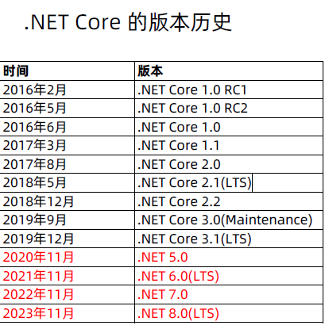
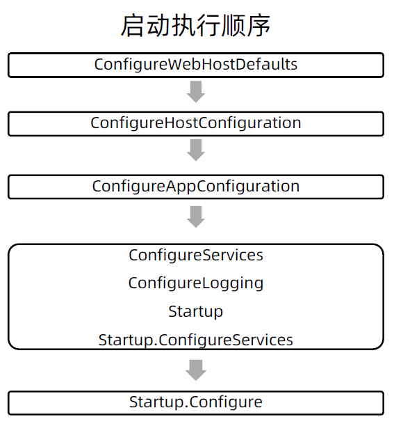

# 2、.NET CORE

## 2.1 小知识

### 2.1.1 路线图



### 2.1.2 能做什么


## 2.2  程序启动

### 2.2.1 IHostBuilder

应用程序启动的核心接口

### 2.2.2 Startup介绍


### 2.2.3 程序启用过程

```c#
ConfigureWebHostDefaults // 注册应用程序必要的几个组件 ---- 配置的组件 容器的组件 等
ConfigureHostConfiguration // 配置应用程序启动时必要的配置，要监听的端口，要监听的URL地址等，在此处可以注入自己的配置至配置框架
ConfigureAppConfiguration // 嵌入我们自己的配置文件，供应用程序来读取
ConfigureServices ConfigureLogging Startup Startup.ConfigureServices  //往容器里面注入应用的组件
    ConfigureServices  // 一般在里面做服务注册 注册我们的类
Startup.Configure //注入我们的中间件，处理httpcontext整个的请求过程的
```


```shell
1、执行方法：ConfigureWebHostDefaults
2、执行方法：Configure Host Configuration
3、执行方法：Configure App Configuration
4.2、执行方法：ConfigureLogging
4.1、执行方法：Configure Services
4.3、执行方法：Startup
4.4、执行方法：ConfigureServices
5、执行方法：Configure
info: Microsoft.Hosting.Lifetime[0]
      Now listening on: http://localhost:5000
info: Microsoft.Hosting.Lifetime[0]
      Application started. Press Ctrl+C to shut down.
info: Microsoft.Hosting.Lifetime[0]
      Hosting environment: Development
info: Microsoft.Hosting.Lifetime[0]
      Content root path: D:\99.dean_pc\08.geektime\07.netcore\03.code\StartupCore\StartupCore
```

```shell
1、执行方法：ConfigureWebHostDefaults
2、执行方法：Configure Host Configuration
3、执行方法：Configure App Configuration
4.1、执行方法：Configure Services
4.2、执行方法：ConfigureLogging
4.3、执行方法：Startup
4.4、执行方法：ConfigureServices
5、执行方法：Configure
info: Microsoft.Hosting.Lifetime[0]
      Now listening on: http://localhost:5000
info: Microsoft.Hosting.Lifetime[0]
      Application started. Press Ctrl+C to shut down.
info: Microsoft.Hosting.Lifetime[0]
      Hosting environment: Development
info: Microsoft.Hosting.Lifetime[0]
      Content root path: D:\99.dean_pc\08.geektime\07.netcore\03.code\StartupCore\StartupCore
```




# 3、依赖注入

[.NET 中的依赖关系注入 | Microsoft Docs](https://docs.microsoft.com/zh-cn/dotnet/core/extensions/dependency-injection#service-lifetimes)

本章节从生命周期角度展开说明

## 3.1 Transient

注册

```c#
 public void ConfigureServices(IServiceCollection services)
 {
     services.AddTransient<IOrderService, DisposableOrderService>();
     ...
 }

 public void Configure(IApplicationBuilder app, IWebHostEnvironment env)
 {
     //从根容器获取瞬时服务
     var iorderService1 = app.ApplicationServices.GetService<IOrderService>();
     var iorderService2 = app.ApplicationServices.GetService<IOrderService>();
     ...
 }
```

效果

```shell
PS D:\\01.StartupCore> dotnet run
1、执行方法：ConfigureWebHostDefaults
2、执行方法：Configure Host Configuration
3、执行方法：Configure App Configuration
4.2、执行方法：ConfigureLogging
4.1、执行方法：Configure Services
4.3、执行方法：Startup
4.4、执行方法：ConfigureServices
5、执行方法：Configure
info: Microsoft.Hosting.Lifetime[0]
      Now listening on: http://localhost:5000
info: Microsoft.Hosting.Lifetime[0]
      Application started. Press Ctrl+C to shut down.
info: Microsoft.Hosting.Lifetime[0]
      Hosting environment: Development
info: Microsoft.Hosting.Lifetime[0]
      Content root path: D:\\01.StartupCore
      
/*访问 http://localhost:5000/MyDipose/Get*/
=======create subinstance==========
DisposableOrderService Disposed:44509763
=======dispose subinstance==========
=======Action end==========
DisposableOrderService Disposed:42946942
DisposableOrderService Disposed:64771460
/*访问 http://localhost:5000/MyDipose/Get2?stop=true*/
info: Microsoft.Hosting.Lifetime[0]
      Application is shutting down...
DisposableOrderService Disposed:20554616
DisposableOrderService Disposed:30762424
```

## 3.2 Scoped

注册

```c#
 public void ConfigureServices(IServiceCollection services)
 {
     services.AddScoped<IOrderService, DisposableOrderService>();
     //services.AddScoped<IOrderService>(sp => new DisposableOrderService());
     ...
 }
```

效果

```shell
PS D:\\01.StartupCore> dotnet run
1、执行方法：ConfigureWebHostDefaults
2、执行方法：Configure Host Configuration
3、执行方法：Configure App Configuration
4.2、执行方法：ConfigureLogging
4.1、执行方法：Configure Services
4.3、执行方法：Startup
4.4、执行方法：ConfigureServices
5、执行方法：Configure
info: Microsoft.Hosting.Lifetime[0]
      Now listening on: http://localhost:5000
info: Microsoft.Hosting.Lifetime[0]
      Application started. Press Ctrl+C to shut down.
info: Microsoft.Hosting.Lifetime[0]
      Hosting environment: Development
info: Microsoft.Hosting.Lifetime[0]
      Content root path: D:\\01.StartupCore

/*访问 http://localhost:5000/MyDipose/Get */
=======create subinstance==========
DisposableOrderService Disposed:50757320
=======dispose subinstance==========
=======Action end==========
DisposableOrderService Disposed:59652943

/*访问 http://localhost:5000/MyDipose/Get2?stop=true */
=======Action2 end==========
info: Microsoft.Hosting.Lifetime[0]
      Application is shutting down...
```

## 3.3 Singleton

注册

```c#
 public void ConfigureServices(IServiceCollection services)
 {
   services.AddSingleton<IOrderService, DisposableOrderService>();
   //services.AddSingleton<IOrderService>(sp=>new DisposableOrderService());
   //services.AddSingleton<IOrderService>(new DisposableOrderService());
   ...
 }
```

结果

```shell
PS D:\\01.StartupCore> dotnet run
1、执行方法：ConfigureWebHostDefaults
2、执行方法：Configure Host Configuration
3、执行方法：Configure App Configuration
4.2、执行方法：ConfigureLogging
4.1、执行方法：Configure Services
4.3、执行方法：Startup
4.4、执行方法：ConfigureServices
5、执行方法：Configure
info: Microsoft.Hosting.Lifetime[0]
      Now listening on: http://localhost:5000
info: Microsoft.Hosting.Lifetime[0]
      Application started. Press Ctrl+C to shut down.
info: Microsoft.Hosting.Lifetime[0]
      Hosting environment: Development
info: Microsoft.Hosting.Lifetime[0]
      Content root path: D:\\01.StartupCore

/*访问 http://localhost:5000/MyDipose/Get */
=======create subinstance==========
=======dispose subinstance==========
=======Action end==========

/*访问 http://localhost:5000/MyDipose/Get2?stop=true */
=======Action2 end==========
info: Microsoft.Hosting.Lifetime[0]
      Application is shutting down...
DisposableOrderService Disposed:64270886
```

## 3.4 Singleton (无释放)

注册

```c#
 public void ConfigureServices(IServiceCollection services)
 {
   //services.AddSingleton<IOrderService, DisposableOrderService>();
   //services.AddSingleton<IOrderService>(sp=>new DisposableOrderService());
   services.AddSingleton<IOrderService>(new DisposableOrderService());
   ...
 }
```

结果

```shell
PS D:\\01.StartupCore> dotnet run
1、执行方法：ConfigureWebHostDefaults
2、执行方法：Configure Host Configuration
3、执行方法：Configure App Configuration
4.2、执行方法：ConfigureLogging
4.1、执行方法：Configure Services
4.3、执行方法：Startup
4.4、执行方法：ConfigureServices
5、执行方法：Configure
info: Microsoft.Hosting.Lifetime[0]
      Now listening on: http://localhost:5000
info: Microsoft.Hosting.Lifetime[0]
      Application started. Press Ctrl+C to shut down.
info: Microsoft.Hosting.Lifetime[0]
      Hosting environment: Development
info: Microsoft.Hosting.Lifetime[0]
      Content root path: D:\\01.StartupCore

/*访问 http://localhost:5000/MyDipose/Get */
=======create subinstance==========
=======dispose subinstance==========
=======Action end==========

/*访问 http://localhost:5000/MyDipose/Get2?stop=true */
=======Action2 end==========
info: Microsoft.Hosting.Lifetime[0]
      Application is shutting down...
```

## 